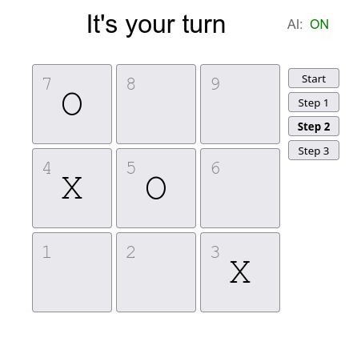

<div align="center">

<h1>Tic Tac Toe</h1>

_A simple Tic Tac Toe game with AI and time travel,
made with JavaScript, Vue.js, HTML, and SCSS._



</div>

## Quick start

Make sure you have a recent version of Node and `npm` installed:

```bash
node --version
npm --version
```

Install Node dependencies:

```bash
npm install
```

Then, run a `vite` server with `npx`:

```bash
npx vite
```

The website "Tic Tac Toe" should then be available at `http://http://localhost:3000/`,
hosted by the `vite` server.

## Credits

The file that are completely written by me are:
- `src/App.vue`
- `src/components/Board.vue`
- `README.md`, which is this file

This app project is initiated with Vue's `create` feature,
which uses a template to automatically initialize a project.
I had based my application on this template, and modified it for a bit.
Nonetheless, credits of files such as `vite.config.js` goes to the Vue and `vite` developers.
